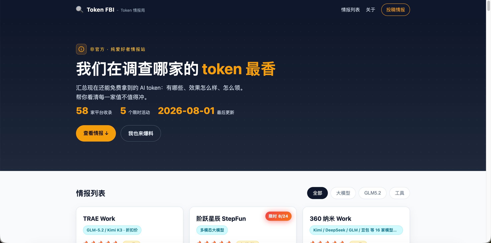

# 🔍 Token 情报局 · Token FBI

> **我们在调查哪家的 token 最香。**

一个爱好者自发维护的**免费 AI token 情报站**——汇总现在还能免费拿到的 AI token：有哪些平台、效果怎么样、怎么领。非官方、不接暗广，只帮你看清哪家的免费额度最值得冲。

---

## 🌐 在线访问

**直接打开即可使用，无需注册、无需安装：**

👉 **[https://1c91cc10f9bc4d9ca5f98f41481b615c.bj9.agentos-app.net](https://1c91cc10f9bc4d9ca5f98f41481b615c.bj9.agentos-app.net)** （国内 / 微信 / 手机浏览器均可直连，推荐）

> 备用镜像（GitHub Pages，桌面端可访问，但国内手机 / 微信内可能打不开）：[https://hope0719.github.io/token-fbi/](https://hope0719.github.io/token-fbi/)



站点实时展示 **大模型类 17 家、工具类 7 家**（共 24 张）的最新免费 token 情报，支持按分类筛选（全部 / 大模型 / 工具），限时活动会标注截止日期角标。

---

## 🎬 使用教程

**【免费 token 集合，WorkBuddy 直接无限 token 使用】**

我们录了一份视频教程，已经 **万人观看**，带你快速上手 Token FBI、领取免费额度：

👉 [Bilibili: 免费 token 集合，WorkBuddy 直接无限 token 使用](https://www.bilibili.com/video/BV1EHM96TEWg?vd_source=849374a5ac857214c3fec62e61b03d00)

视频里会演示：
- 如何打开 Token FBI 查看最新情报
- 如何筛选「大模型」和「工具」两类平台
- 如何找到 WorkBuddy 等工具的免费 token 入口
- 实际领取与使用的完整流程

---

## 📖 这是什么？

Token FBI 是一张**活着的免费 AI token 名录**。

现在各家大模型和 AI 平台都在疯狂送额度——注册就送、新用户礼包、限时活动……但信息散落在各处，很多好东西你根本不知道存在。

我们做了一件事：**把所有还在有效期内的免费 token 汇总到一页，每张卡片告诉你：**

| 卡片字段 | 含义 |
| :--- | :--- |
| **名称** | 平台 / 产品名 |
| **类型** | 大模型 / 工具（聚合平台、发 Token 活动归大模型；编程/写作/代理 App 归工具） |
| **支持模型** | 该平台提供的模型阵容 |
| **星级 ★** | 1~5 星，综合考量额度大小、模型质量、领取门槛 |
| **免费额度** | 具体能拿多少（Token 数 / 金额 / 调用次数） |
| **效果如何** | 实际体验：能干什么、够用多久、有什么限制 |
| **怎么领** | 一步步操作指引 + 注意事项 |
| **入口链接** | 一键跳转到领取页面 |

### 适用人群

- **AI 学习者 / 爱好者**——想免费用各种大模型 API 做实验、跑项目
- **开发者 / 创业者**——需要多平台对比、找最划算的免费额度
- **培训讲师 / 内容创作者**——帮学员或读者快速了解当前免费资源全景
- **任何人**——只是好奇「现在到底有哪些免费的 AI 可以用」

---

## 🎯 精选模型与收录标准

本站当前以以下 **6 个前沿模型**为核心筛选门槛，优先收录能直接调用这些模型的平台：

| 精选模型 | 说明 |
| :--- | :--- |
| **DeepSeek V4** | 国产顶级开源模型，2026-04 发布 |
| **GLM 5.2** | 智谱新一代，1M 无损上下文，MIT 开源 |
| **Kimi K3** | 月之暗面 2.8T 旗舰，2026-07 全量开源 |
| **千问 3.8** | 阿里 Qwen3.8-Max-Preview（预览版） |
| **Hy3** | 腾讯混元 3，2026-04 preview，开源 256K |
| **LongCat 2.0** | 美团 1.6T 模型，2026-06-30 发布 |

> **补充保留**：以下平台/模型虽不属上述 6 个精选，但因**多模态能力突出**或**聚合价值高**而保留：
> - **阶跃星辰 StepFun**（Step 3.7 Flash 原生多模态，文/图/音/视频全能；⚠️ 限时活动已结束，新用户仅余 10 额度，仍因多模态能力保留）
> - **NVIDIA NIM 免费 API**（聚合多模型，含 GLM-5.2 等主流模型）
> - **Agnes AI**（全模态模型，不限期 RPM 20 免费）

**下架原则**：只挂冷门自研/垂直小模型、或仅提供上一轮旧代际模型且无聚合价值的平台，会定期清理，确保名录精简实用。

---

## 🧭 收录逻辑（收不收、归哪类，一目了然）

本站的收录不是"来者不拒"，而是一套明确规则。任何一张卡片能否上架、归入哪类，都按以下逻辑判定：

### 1. 收录门槛：是否覆盖精选模型

- **核心 6 模型**（满足其一即收录）：DeepSeek V4 / GLM 5.2 / Kimi K3 / 千问 3.8 / Hy3 / LongCat 2.0
- **多模态保留 3 家**：阶跃 StepFun / NVIDIA NIM / Agnes AI（因多模态能力或聚合价值保留，不要求覆盖上述 6 个）
- 只挂冷门自研模型、或仅提供上一代旧模型且无聚合价值的平台 → **不收录**

### 2. 归类规则：大模型 vs 工具

每张卡片必须归入两类之一，判定依据：

| 归为「大模型」 | 归为「工具」 |
| :--- | :--- |
| 模型提供方（直接给 LLM API 额度） | 编程 / 写作 / 代理类 App |
| 模型聚合平台（一个 Key 接 100+ 模型） | IDE 插件、编码助手、Agent 平台 |
| 发放 Token 的扶持活动 | 应用型工具产品 |

> 易错提示：聚合平台 / 发 Token 活动 / 模型提供方都属于「大模型」，不是工具。已纠正的反例：微信 AI 小程序成长计划、OpenRouter、ZenMux 均为模型聚合/活动，归「大模型」；京东 JoyAgent 因体验差且归类不清，已删除。

### 3. 推荐工具：严格按指定清单

本站推荐工具 **只展示站长明确指定的 App**，不自行推导或编造（相关 App 以卡片形式收录在名录中）：
- 当前指定：WorkBuddy / Dumate / TRAE Work / catpaw

### 4. 统计口径

- 顶部统计按分类实时计算：**大模型类 N · 工具类 M**（由渲染逻辑 `catOf()` 实时得出，增减卡片自动更新）
- 不称"XX 家平台"，一律以"大模型类 / 工具类"口径表述

---

## ✨ 主要功能

### 📋 情报列表 + 分类筛选

打开站点即看到所有已收录平台的卡片列表。顶部筛选栏支持三种视图：

- **全部** — 全部卡片一览无余
- **大模型** — 提供 LLM API 免费额度的模型 / 聚合平台
- **工具** — IDE 插件、Agent 平台、编码助手等应用层工具

### ⏰ 限时活动角标

部分平台的活动有明确截止日期，这类卡片右上角会显示红色「限时 YYYY-MM-DD」角标，提醒你抓紧领取。当前在限时的活动：

| 平台 | 截止日期 |
| :--- | :--- |
| 微信 AI 小程序成长计划 | 2026-12-31 |
| WorkBuddy（HY3 限免） | 2026-08-31 |
| 腾讯云 TokenHub | 2026-12-31 |

> ⚠️ 限时活动可能随时延期或提前结束，领之前请以各平台官方页面为准。

### 📊 实时统计

站点 Hero 区域展示核心数据（按分类实时计算，增减卡片自动更新）：
- **大模型类 / 工具类数量** — 例如「大模型类 17 · 工具类 7」，不称"XX 家平台"
- **限时活动数** — 还有多少个正在倒计时的活动
- **最后更新日期** — 最近一次情报刷新时间

### 📱 响应式设计

桌面端 / 平板 / 手机均可正常浏览，卡片自适应布局。

---

## 🏢 已收录平台（大模型类 17 · 工具类 7，共 24 家）

以下为截至 **2026-08-07** 的完整收录清单，按数组顺序排列（星级 ★ 随体验动态变化）：

| # | 平台 | 类型 | 核心模型 | 星级 |
|:--:|:---|:---|:---|:--:|
| 1 | WorkBuddy | 工具 | HY3 · 混元3（HY3 限免至 8/31） | ★★★★★ |
| 2 | 腾讯 Marvis（马维斯） | 工具 | 混元 / DeepSeek V4 · 操作系统级 AI | ★★★★ |
| 3 | 火山引擎 Ark 协作计划（字节） | 大模型 | GLM5.2 · 文本模型 | ★★★★★ |
| 4 | 七牛云 AI 推理 | 大模型 | GLM5.2 · 文本模型 | ★★★★★ |
| 5 | 美团 catpaw（App） | 工具 | GLM 5.2 · DeepSeek V4 Pro · Kimi K3 | ★★★★★ |
| 6 | TRAE Work | 工具 | GLM-5.2 / Kimi K3 · 折扣价 | ★★★★ |
| 7 | 硅基流动 SiliconFlow | 大模型 | GLM5.2 等全模型 · 文本/多模态 | ★★★★ |
| 8 | NVIDIA NIM 免费 API | 大模型 | 多模型聚合（文本 / 多模态） | ★★★★★ |
| 9 | 商汤 Token Plan（sensenova） | 大模型 | SenseNova 6.7 / DeepSeek V4 Flash · 日日新 | ★★★ |
| 10 | Agnes AI | 大模型 | 全模态模型 | ★★★★★ |
| 11 | 美团 longcat 大模型 | 大模型 | LongCat 文本模型 | ★★★★★ |
| 12 | OpenRouter | 大模型 | 35+ 聚合模型（Kimi K2 / Qwen3 / Llama） | ★★★★ |
| 13 | 阶跃星辰 StepFun | 大模型 | 多模态大模型（活动已结束，仅新用户 10 额度） | — |
| 14 | BazaarLink | 大模型 | DeepSeek V4 Flash · 1M 上下文 | ★★ |
| 15 | AtomCode CodingPlan | 工具 | GLM-5.2 / DeepSeek-V4-Flash / Qwen3-VL | ★★ |
| 16 | HuggingFace Inference API | 大模型 | DeepSeek V4 / Qwen3 / Mistral 等 | ★★ |
| 17 | 月之暗面 Kimi 开放平台 | 大模型 | Kimi K2.6 / K2.5 · 长上下文 MoE | ★★ |
| 18 | 魔搭社区 ModelScope | 大模型 | Qwen / LUX / SD 等 · 文本+多模态（魔豆计费） | ★ |
| 19 | OpenStarry | 工具 | GLM 5.2 / DeepSeek V4 / Kimi K2.6 等 40+ | ★ |
| 20 | OpenCode Zen | 工具 | DeepSeek V4 Flash Free / MiMo-V2.5 等 | ★★ |
| 21 | 微信 AI 小程序成长计划（云开发 CloudBase） | 大模型 | Hy3 + Hy Image 3.0 · 文本/生图 | ★★★ |
| 22 | ZenMux | 大模型 | DeepSeek V4 · Kimi K2.7 · GLM 5.2 · Step | ★★★ |
| 23 | 腾讯云 TokenHub | 大模型 | Hy3 · DeepSeek V4 · GLM-5 · Kimi-K2.5 | ★★★ |
| 24 | 天翼云息壤（电信） | 大模型 | GLM-5 · DeepSeek V4 · Qwen3.5 · Doubao 等 | ★★ |

> 📌 **降级区说明**：第 14~24 名（BazaarLink / AtomCode / HuggingFace / 月之暗面 / 魔搭 / OpenStarry / OpenCode Zen / 微信成长计划 / ZenMux / TokenHub / 天翼云）于 **2026-08-07** 各扣两星并移至名录末位观察，恢复需重新评估。

---

## 🤝 投稿 & 参与

发现哪家有新的免费 token 额度？**非常欢迎你来补充！** 我们一起把这张情报网织得更密。

### 方式一：GitHub Issue / PR

👉 [去提 Issue 或 PR](https://github.com/hope0719/token-fbi/issues)

在仓库提交一条新情报，格式参考：

```js
{
  name: "平台名称",
  type: "大模型",        // 或 "工具"
  modality: "支持的模型",
  rating: 4,             // 星级 1~5
  quota: "免费额度说明",
  effect: "效果怎么样",
  how: "怎么领（步骤指引）",
  link: "https://...",
  updated: "2026-08-03"  // 今天日期
}
```

### 方式二：微信群爆料

打开站点底部「投稿情报」区域，扫码添加站长微信，备注 **「Token FBI」**，拉你进群直接交流。

---

## ⭐ 如果这个站对你有帮助

这个项目完全由爱好者**业余时间维护**，没有任何商业目的。如果你觉得它帮你省了钱、省了时间：

- **给个 ⭐ Star** —— 让更多人看到这份免费资源名录
- **转发给朋友** —— 特别是正在学 AI、做开发的小伙伴
- **投稿新情报** —— 帮我们把遗漏的平台补上

[](https://github.com/hope0719/token-fbi/stargazers)

👉 **[⭐ 点这里给个 Star](https://github.com/hope0719/token-fbi)**

---

## 🛠 本地运行

```bash
# 克隆仓库
git clone https://github.com/hope0719/token-fbi.git
cd token-fbi

# 启动本地预览
python3 -m http.server 8080
# 浏览器打开 http://localhost:8080
```

纯静态站点，无需构建步骤，`index.html` + `style.css` + `app.js` 三个文件即可运行。

## 📂 项目结构

```
token-fbi/
├── index.html          # 页面骨架（头部 / Hero / 列表 / 关于 / 投稿 / 页脚）
├── style.css           # 样式（深色情报局风 + 琥珀金强调色）
├── app.js              # 卡片数据 TOKENS 数组 + 渲染逻辑 + 分类筛选
├── qrcode-wechat.jpg   # 微信投稿二维码
├── screenshot.png      # 站点截图（README 用）
└── README.md           # 本文件
```

## 📜 免责声明

- 本站为**非官方、爱好者自发维护**的情报汇总，与各 AI 平台无任何关联。
- 所有免费额度政策以各平台官方页面为准，本站信息仅供参考。
- 情报具有时效性，平台可能随时调整或取消免费活动。
- 仅收录**真实免费可领取**的 token / 额度，不收录付费抵扣券、需捆绑消费的「伪免费」。

---

## 🔄 最近更新

- **2026-08-07（晚间）**：11 家平台（BazaarLink / AtomCode / HuggingFace / 月之暗面 / 魔搭 / OpenStarry / OpenCode Zen / 微信成长计划 / ZenMux / TokenHub / 天翼云）各扣两星，并移至名录末位「降级区」观察
- **2026-08-07**：① 商汤日日新系列报错频发（白天不建议用）→ 扣一星 + 加警告；② 魔搭改「魔豆」计费、免费次数缩水 → 扣一星；③ 阶跃星辰限时活动结束，新用户仅 10 额度 → 降为 0 星；④ WorkBuddy 限免延至 8/31；⑤ TRAE Work 分享链接更新；⑥ 静态页 Hero 重构、统计改为实时计算；⑦ 主访问链接切换为 CloudStudio 国内镜像
- **2026-08-05**：WorkBuddy 限免信息刷新；硅基流动新用户基础免费额度 + 邀请得 14 元
- **2026-08-03**：精选模型 curation，下架杂牌/旧代际卡，当前保留 24 张高质量卡片（大模型类 17 · 工具类 7）；删除京东 JoyAgent，统计文案改为「大模型类 / 工具类」
- **2026-08-01**：新增白山云智算、无问芯穹、腾讯元器、PPIO 派欧云；StepFun 活动延至 8/24
- **2026-07-31**：新增 360 纳米 Work、BazaarLink

---

<p align="center">
  <strong>Token 情报局 · Token FBI</strong><br>
  <span style="color:#888;">我们在调查哪家的 token 最香</span><br>
  <span style="color:#888;">© 2026 爱好者情报站 · 非官方</span>
</p>
